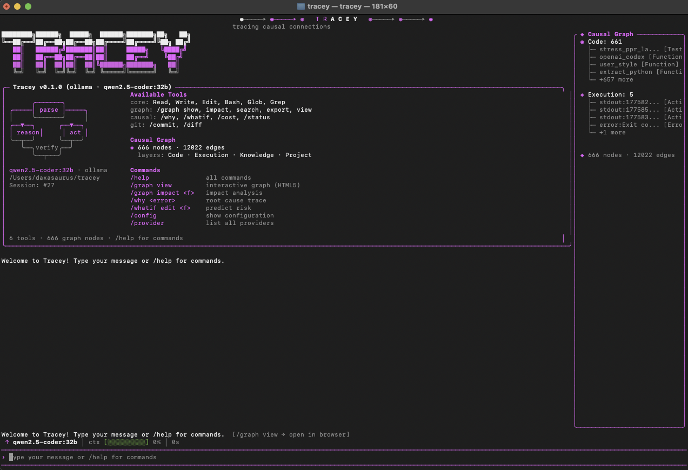

# Tracey



A coding agent that keeps a live causal graph of your codebase. Every file it touches, every edit, every bug it finds — all of it becomes a node. Before making a change it queries the graph to see what might break. After, it writes back what actually happened.

Most coding agents reason in the dark. You give them a task, they flail through the repo, they forget everything the moment the session ends. Tracey keeps track. What calls what, what broke what, what you said you cared about, what patterns it's already seen.

## what's in the graph

Four layers:

- **code** — files, functions, classes, imports, pulled from AST
- **execution** — actions, errors, observations, added as the agent runs
- **knowledge** — bugs, solutions, patterns, decisions, extracted from the agent's own reasoning
- **project** — tasks, constraints, goals, from your messages

Edges are typed (`calls`, `imports`, `caused`, `prevented`, `explains`, `resolves`...) and carry a confidence score that decays over time if nobody touches them. Edges from static analysis are trusted more than edges the LLM inferred. The agent won't stampede over uncertain knowledge.

## install

```bash
cargo install --git https://github.com/CTRLabs/tracey tracey-cli
```

then:

```bash
tracey --setup       # pick a provider (anthropic, openai, ollama, and ~12 others)
tracey               # interactive TUI
tracey "fix the null check in auth.rs"        # one-shot
echo "explain this codebase" | tracey --print # pipe-friendly
```

## how it works

Every turn runs an OODA-C loop:

1. **observe** — gather what's in context
2. **orient** — query the graph for relevant nodes via Personalized PageRank
3. **decide** — the LLM reasons with that graph context injected
4. **act** — run tools (Read, Write, Edit, Bash, Glob, Grep, WebFetch, WebSearch, Agent, NotebookEdit, Todo)
5. **causify** — update the graph with what happened, extract knowledge from the reasoning trace
6. **verify** — check for contradictions, decay stale edges

Every few iterations the agent also runs an introspection pass — it reads its own graph and notices things: repeated actions (stuck loop), contradictions, low-confidence territory. That gets injected back as a self-snapshot so it can course-correct.

There's a 2D and 3D graph viewer at `http://localhost:3142/graph` and `/graph3d` — the TUI spins these up automatically so you can watch the graph grow in a browser while the agent works.

## the research this is built on

The premise that a robust agent has to learn causal structure — not just patterns of correlation — comes from [Richens & Everitt (ICLR 2024)](https://arxiv.org/abs/2402.10877). They prove that any agent whose regret stays bounded across distributional shifts must have implicitly learned an approximate causal model of its environment. For a coding agent, every edit is an intervention and every test is a partial oracle, so that result applies pretty directly: an agent that only chases correlations is going to fail on the first real refactor.

The graph-based retrieval is closest to [HippoRAG (NeurIPS 2024)](https://arxiv.org/abs/2405.14831), which adapts Personalized PageRank for multi-hop retrieval and reports around 20% improvement over flat retrieval on multi-hop QA. Tracey borrows HippoRAG's node-specificity weighting — `log(N / degree)` on the PPR seeds — so hub nodes like `main.rs` don't drown out the rest of the graph on every query.

The repo-level graph representation owes a lot to [RepoGraph (ICLR 2025)](https://arxiv.org/abs/2410.14684), which showed that plugging a line-level dependency graph into existing SWE-bench agents lifted their resolve rate by 32.8% on average, and to [LocAgent (ACL 2025)](https://arxiv.org/abs/2503.09089), which hits 92.7% file-level localization accuracy using graph-guided traversal. The multi-layer separation — keeping structural edges apart from execution traces apart from learned knowledge — echoes [MAGMA's](https://arxiv.org/abs/2601.03236) finding that orthogonal graphs for different signal types beat a flat unified memory.

The part where the agent extracts knowledge from its own reasoning and writes it back as persistent nodes is shaped by [TIMG](https://arxiv.org/abs/2603.10600) and [Reflexion (NeurIPS 2023)](https://arxiv.org/abs/2303.11366). The topological ordering of the retrieved subgraph in the prompt — putting cause nodes before effect nodes so the chain-of-thought aligns with the graph — comes from ["Causal Graphs Meet Thoughts"](https://arxiv.org/abs/2501.14892).

**An honest note on "causal."** Right now most of Tracey's edges are structural (from AST parsing) or LLM-inferred (from the agent's reasoning). Neither is interventional in the Pearl sense — they're scaffolding for causal reasoning, not a true structural causal model. Making the edges properly interventional is the next step: mutation testing to promote `Calls` edges to causal ones, treating git commits as interventions, and counterfactual replay. We don't claim what we haven't earned yet.

## architecture

16-crate Cargo workspace:

| crate | what it does |
|-------|--------------|
| `tracey-core` | shared types, events, traits |
| `tracey-config` | TOML config, credential pool, setup wizard |
| `tracey-llm` | Anthropic + OpenAI providers, routing |
| `tracey-tools` | 11 tools (Read/Write/Edit/Bash/Glob/Grep/WebFetch/WebSearch/Agent/NotebookEdit/Todo) |
| `tracey-graph` | the 4-layer graph, PPR, persistence, verification |
| `tracey-memory` | multi-signal memory retrieval |
| `tracey-agent` | OODA-C loop, observer, introspection, code→graph ingestion |
| `tracey-ast` | AST parsing for 10 languages |
| `tracey-search` | vector index + FTS5 hybrid |
| `tracey-session` | JSONL session store with full-text search |
| `tracey-sandbox` | permission modes (plan / default / bypass / strict) |
| `tracey-hooks` | lifecycle hook runner |
| `tracey-skills` | `SKILL.md` loading |
| `tracey-tui` | ratatui terminal UI |
| `tracey-telegram` | Telegram bot |
| `tracey-cli` | entry point |

## config

TOML with three levels (global → project → env vars):

```
~/.config/tracey/config.toml
<your-project>/.tracey/config.toml
ANTHROPIC_API_KEY, OPENAI_API_KEY, ...
```

Drop a `TRACEY.md` in your project root for per-project instructions, same idea as Claude Code's `CLAUDE.md` or Cursor's rules.

## permission modes

Set with `/mode` in the TUI:

- **plan** — read-only, agent can explore and propose
- **default** — normal per-rule resolution (deny > ask > allow)
- **bypass** — skip every ask prompt, for trusted automation
- **strict** — ask before anything, even reads

## license

MIT
